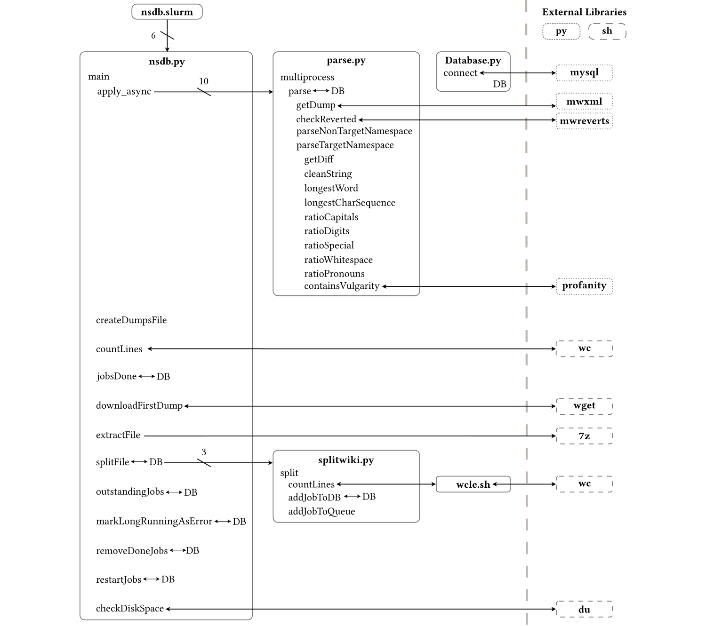

## Contents
* [Program execution](#program-execution)
* [nsdb.py](#module-nsdb)
* [parse.py](#module-parse)
* [splitwiki.py](#module-splitwiki)
* [Database.py](#module-database)

Program execution
-----------------

----
Module [nsdb](nsdb/nsdb.py)
===========
This script finds the fastest mirror, downloads and splits one Wikipedia
dump.

This script relies on running in a bash environment. Windows users are
encouraged to install Windows Subsystem for Linux.

This tool uses a MySQL database.

Please run pip install -r requirements.txt before running this script.

**Usage:**
```
  nsdb.py [-h] [-w WIKI] [-d DUMP] [-c FREECORES] [-i PARALLELID] [-n NUMPARALLEL] [-D DATADIR] [-s MAXSPACE]
```
**Optional Arguments:**
```
  -h, --help
      show this help message and exit
  -w --wiki WIKI
      The name of the wiki you want to use [default: enwiki]
  -d --dump DUMP
      Which dump you want to use, a date string in the format YYYYMMDD. 
      By default will use the dump before latest.
  -c --freeCores FREECORES
      The number of cores you don't want to be used [default: 0]
  -i --parallelID PARALLELID
      Set when called from the slurm script [default: 0]
  -n --numParallel NUMPARALLEL
      Set when called from the slurm script [default: 1]
  -D --dataDir DATADIR
      Directory where the dumps, partitions etc will be stored [default: ../]
  -s --maxSpace MAXSPACE
      Max gigabytes that you would like the program to use. Min 50gB [default: 150]
```

Functions
---------

    
`checkDiskSpace(dataDir)`
:   Returns the size of the data directory

    
`countLines(file)`
:   Returns the number of lines in a file using wc from bash

    
`createDumpsFile(listOfDumps, wiki='enwiki', dump='')`
:   Creates dumps.txt if it doesn't exist

    
`defineArgParser()`
:   Creates parser for command line arguments

    
`downloadDump(dump, listOfDumps, archivesDir, dumpsDir)`
:   Downloads the first dump in dumps.txt if it is not already present
    in the dumps directory

    
`extractFile(fileName, archivesDir, dumpsDir)`
:   Unzip if not already extracted, delete if extracted
    
    Execution takes 5-15 minutes as a guideline

    
`findFastestMirror(dump='20200401', wiki='enwiki/')`
:   Gets a list of the fastest mirrors, downloads a single file from each
    and returns the fastest one.
    
    Execution takes 5-10 seconds as a guideline
    
    Returns
    -------
    fastestMirror: str - the url of the fastest mirror

    
`jobsDone()`
:   Returns True if all jobs are done

    
`main(wiki='enwiki/', dump='', parallelID=0, numParallel=1, dataDir='/bigtemp/ckm8gz/', maxSpace=600, freeCores=0)`
:   Download a list of dumps if it doesn't exist. If there are no dumps,
    download one and split it, then process the dump on multiple threads
    
    Parameters
    ----------
    wiki: str - The name of the wiki you want to use
    dump: str - Which dump you want to use, a date string in the format YYYYMMDD. By
        default will use the dump before latest.
    parallelID: str - set when called from the slurm script. Slurm is used for running
        this tool in a distributed fashion.
    numParallel: int - set when called from the slurm script.
    dataDir: str - directory where the dumps, partitions etc will be stored. If you
        are using this on a personal computer, I recommend using '../'. If external
        storage is available you should enter the path here.
    maxSpace: int - maximum number of gigabytes that you would like the program to use.
        At minimum this should be 50gB.
    freeCores: int - the number of cores you don't want to be used. For best results
        set this to zero.

    
`markLongRunningJobsAsError()`
:   Marks jobs that take over 15 minutes as error.
    
    This doesn't halt execution but does allow the job to be requeued.

    
`outstandingJobs()`
:   Returns number of jobs with status 'todo' or 'failed'

    
`parseError(error)`
:   Logs errors from parse processes to a file

    
`removeDoneJobs(partitionsDir)`
:   Remove partitions that are completed

    
`restartJobs()`
:   NOT IMPLEMENTED - Restart jobs labelled failed, mark them as restarted

    
`splitError(error)`
:   Logs errors from split processes to a file

    
`splitFile(fileName, queue, dumpsDir, partitionsDir, numPartitions)`
:   Split a dump into a number of partitions

-----


Module [parse](nsdb/parse.py)
============
This script allows the user to parse a dump from a database connection
and extract features to a database table.

This tool uses a MySQL database that is configured in the Database() module.

Functions
---------

    
`checkReverted(detector, revision, cursor, undidRevision, target, editIdToUserId)`
:   Inserts reverted edits into the database for target namespace, otherwise 
    returns the user that was reverted

    
`cleanString(string)`
:   Removes special characters and unnecessary whitespace from text

    
`containsVulgarity(string)`
:   Returns whether text contains profanity based on a simple wordlist approach

    
`getDiff(old, new, parallel, partitionsDir)`
:   Returns the diff between two edits using wdiff
    
    Parameters
    ----------
    old : str - old revision
    new : str - new revision
    
    Returns
    -------
    added: str - all the text that is exclusively in the new revision
    deleted: str - all the text that is exclusively in the old revision
    parallel: str - id of the parallel process, 0 if not

    
`getDump(partitionsDir, cursor)`
:   Returns the next dump to be parsed from the database
    
    Parameters
    ----------
    cursor: MySQLCursor - cursor allowing CRUD actions on the DB connections
    
    Returns
    -------
    dump: class 'mwxml.iteration.dump.Dump' - dump file iterator
    fileName: str - fileName of dump

    
`longestCharSequence(string)`
:   Returns the length of the longest repeated character sequence in text

    
`longestWord(string)`
:   Returns the length of the longest word in text

    
`markAsNotFound(fileName)`
:   

    
`multiprocess(partitionsDir, namespaces, queue, jobId)`
:   Wrapper around process to call parse in a multiprocessing pool

    
`parse(partitionsDir='/bigtemp/ckm8gz/partitions/', namespaces=[1], parallel='')`
:   Selects the next dump from the database, extracts the features and
    imports them into several database tables.
    
    Detailed extraction of features is performed for namespaces of interest.
    Pages that are not in the namespace of choice will instead only have the edits
    counted per user.
    
    Parameters
    ----------
    partitionsDir: str - where the partitions are stored
    namespaces : list[int] - Wikipedia namespaces of interest.
    parallel: str - whether to parse with multiple cores

    
`parseNonTargetNamespace(page, title, namespace, cursor, parallel='')`
:   Counts the number of edits each user makes and inserts them to the database.
    
    Parameters
    ----------
    page: mwtypes.Page
    title: str - Title of the page
    namespace: str - Namespace of the page
    cursor: MySQLCursor - cursor allowing CRUD actions on the DB connections
    parallel: str - id of process, hides progress bars if present

    
`parseTargetNamespace(page, title, namespace, cursor, parallel, partitionsDir)`
:   Extracts features from each revision of a page into a database
    
    Ignores edits that have been deleted like:
        https://en.wikipedia.org/w/index.php?oldid=614217720
    
    Parameters
    ----------
    page: mwtypes.Page
    title: str - Title of the page
    namespace: str - Namespace of the page
    cursor: MySQLCursor - cursor allowing CRUD actions on the DB connections
    parallel: str - id name of parallel slurm process, present if called from parallel,
      hides progress bars

    
`ratioCapitals(string)`
:   Returns the ratio of uppercase to lowercase characters in text

    
`ratioDigits(string)`
:   Returns the ratio of digits to all characters in text

    
`ratioPronouns(string)`
:   Returns the ratio of personal pronouns to all words in text

    
`ratioSpecial(string)`
:   Returns the ratio of special characters to all characters in text

    
`ratioWhitespace(string)`
:   Returns the ratio of whitespace to all characters in text

-----


Module [splitwiki](nsdb/splitwiki.py)
================
This script looks in the dumps/ directory and splits the first file into 40
partitions by default. This can be changed by adjusting the parameters to split()

Functions
---------

    
`addJobToDatabase(cursor, partitionName)`
:   Inserts partition into the database

    
`addJobToQueue(queue, jobId)`
:   Adds partition to the multiprocessing queue

    
`countLines(file)`
:   Returns the estimated number of lines in a dump using wcle.sh

    
`split(number=10, inputFolder='/bigtemp/ckm8gz/dumps/', outputFolder='/bigtemp/ckm8gz/partitions/', deleteDump=True, fileName='', queue=0, cursor=0)`
:   Splits Wikipedia dumps into smaller partitions. Creates a file
    partitions.txt with the created partitions.
    
    The lower the number of partitions, the lower the total size of the partitions
    and the lower the running time to generate them. For this reason, it is recommended
    to set the number to a multiple of the number of processes running splitwiki.
    
    For example, splitting one dump:
    100 partitions - 5046 seconds - 39.2 GB
     50 partitions - 5002 seconds - 39.2 GB
     10 partitions - 4826 seconds - 37.2 GB
      5 partitions - 3820 seconds - 36   GB

-----


Module [Database](nsdb/Database.py)
===============
This module creates a database connection for other scripts to use.

The connection is configured in the private.cnf function. See public.cnf for an
example configuration.

Functions
---------

    
`connect()`
:   Connect to MySQL database using password stored in options file
    
    Returns
    -------
    database: MySQLConnection - connection to the MySQL DB
    cursor: MySQLCursor - cursor allowing CRUD actions on the DB connections

-----
