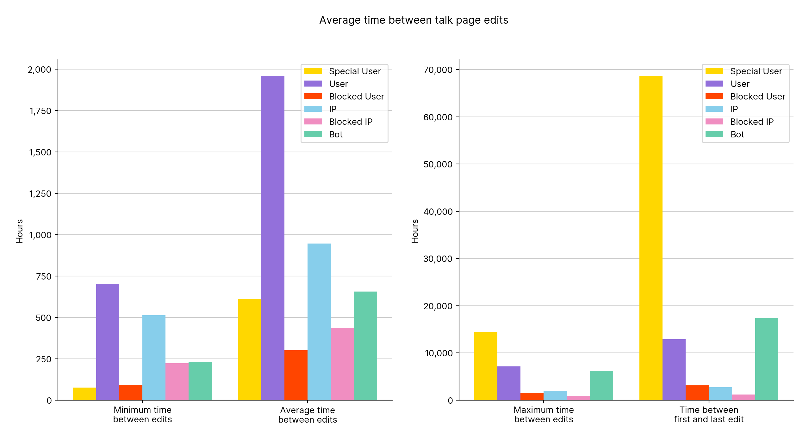
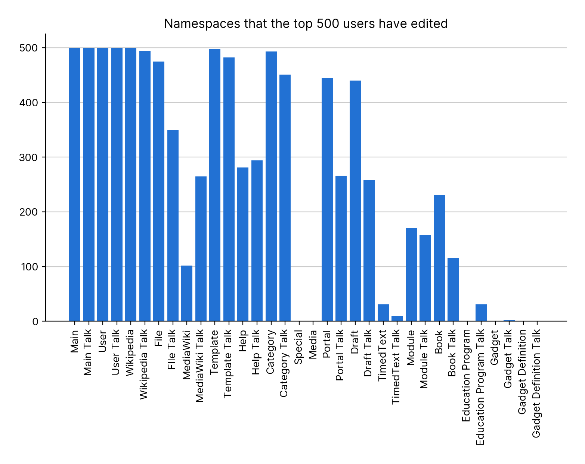
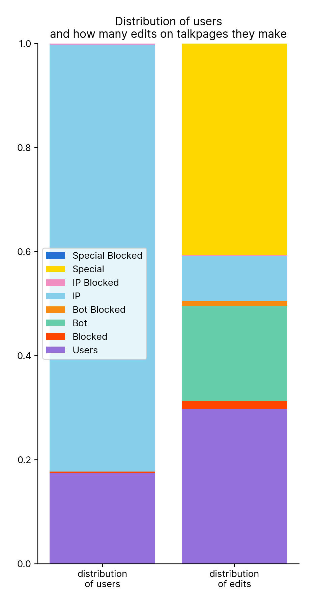
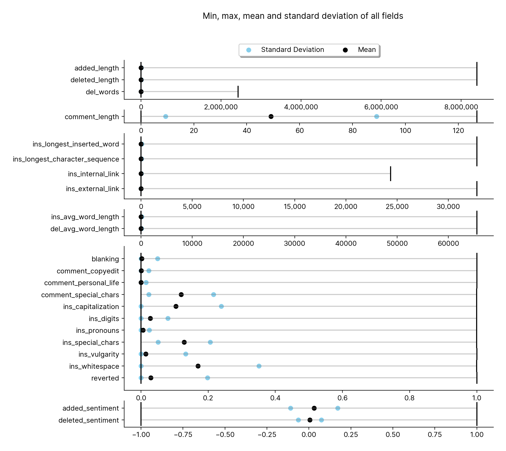
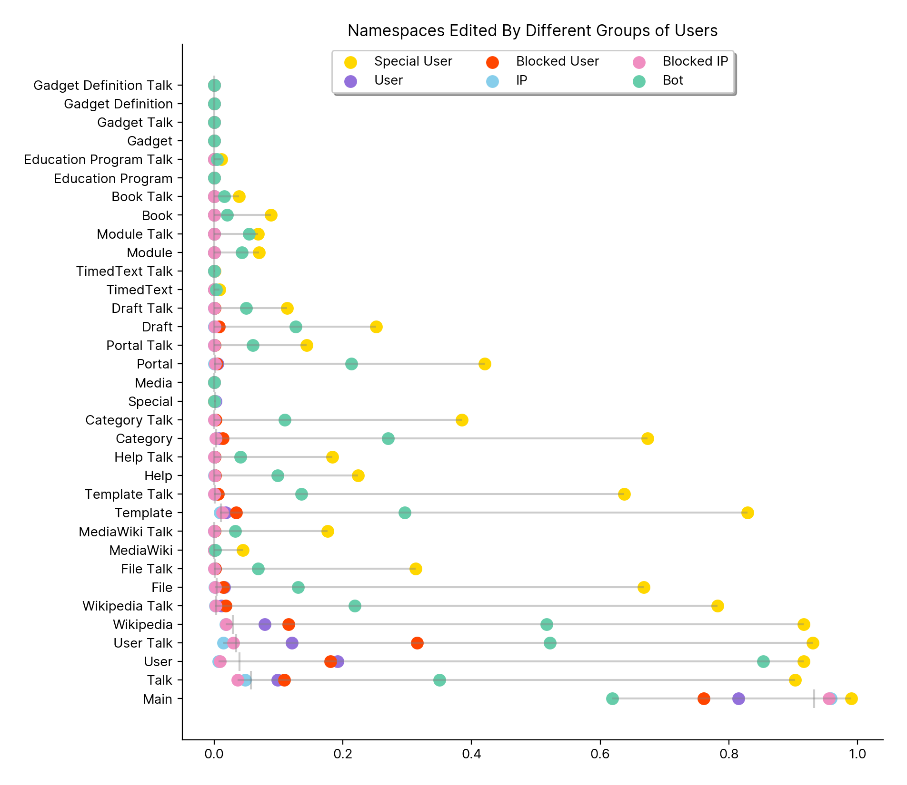
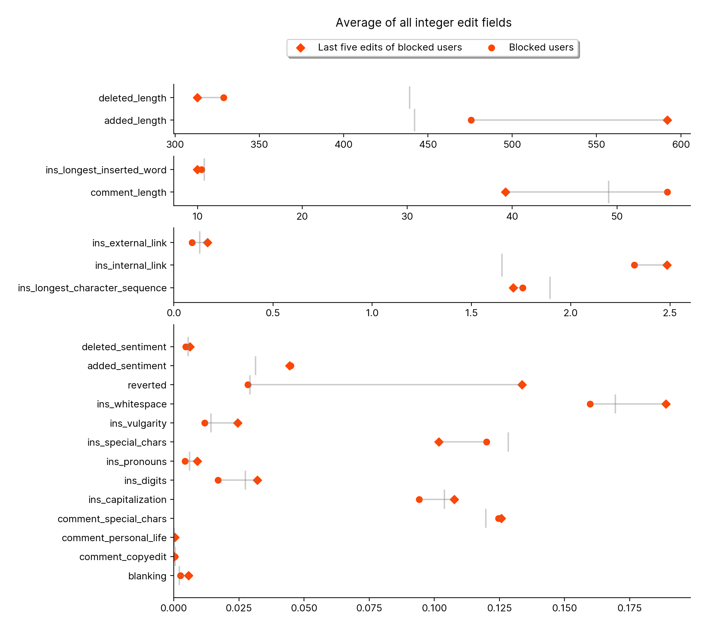

### 0 Partition Status

### 1 Distribution Of Main Edits

### 2 Distribution Of Talk Edits

### 3.1 Number Of Pages Per Namespace - linear

### 3.2 Number Of Pages Per Namespace - log

### 4 Edits Main Talk Neither

### 5 Num Main Talk Edits For Biggest Users

### 6 Num Main Talk Edits For Biggest Bots

### 7 Num Main Talk Edits For Biggest IPs

### 8 Distribution Of Main Edits User Bots

### 9 Edits Main Talk Neither User Bots

### 10.1 Edit Times User Bots

### 10.2 Edit Times User Bots

### 11 Distribution Of Edits Per Namespace

### 12 Sentiment User Bots Blocked IP

### 13.1 Sentiment Groups

### 13.2 Sentiment Groups

### 14 Profanity All

### 15 Average All

### 16 Namespaces Edited By Top Five Hundred

### 17 Internal External Links

### 18.1 Special Users Plot - linear

### 18.2 Special Users Plot - log

### 19 Average All Special

### 20 Composition Of User IP

### 21 Composition Of User

### 22 Aggregations

### 23 Edit Booleans

### 24 User Booleans

### 25 Talkpage Edits Over Time

### 26 Average All Epoch

### 27 Average Features Over Time

### 28 Average Features Over Year

### 29 Namespaces Edited By User Groups

### 30 Talkpage Edits Time Averaged

### 31 Talkpage Edits Over Time No Bots

### 32 Average Blocked Last Edits

### 33 Talkpage Edits Time Averaged No Bots

### 34 Talkpage Edits Time Groups

### 35.1.1 Average Features Over Time Groups Month

### 35.1.2 Average Features Over Time Groups Month

### 35.1.3 Average Features Over Time Groups Month

### 35.1.4 Average Features Over Time Groups Month

### 35.1.1 Average Features Over Time Groups Year

### 35.1.2 Average Features Over Time Groups Year

### 35.1.3 Average Features Over Time Groups Year

### 35.1.4 Average Features Over Time Groups Year
