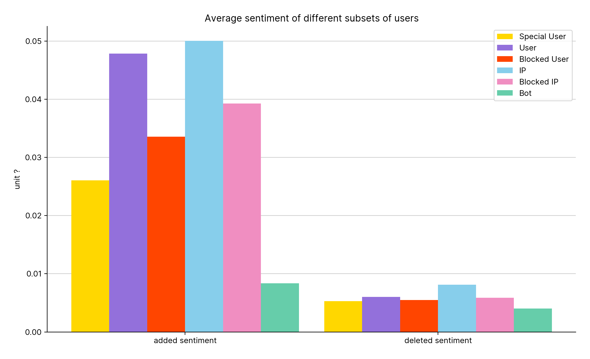
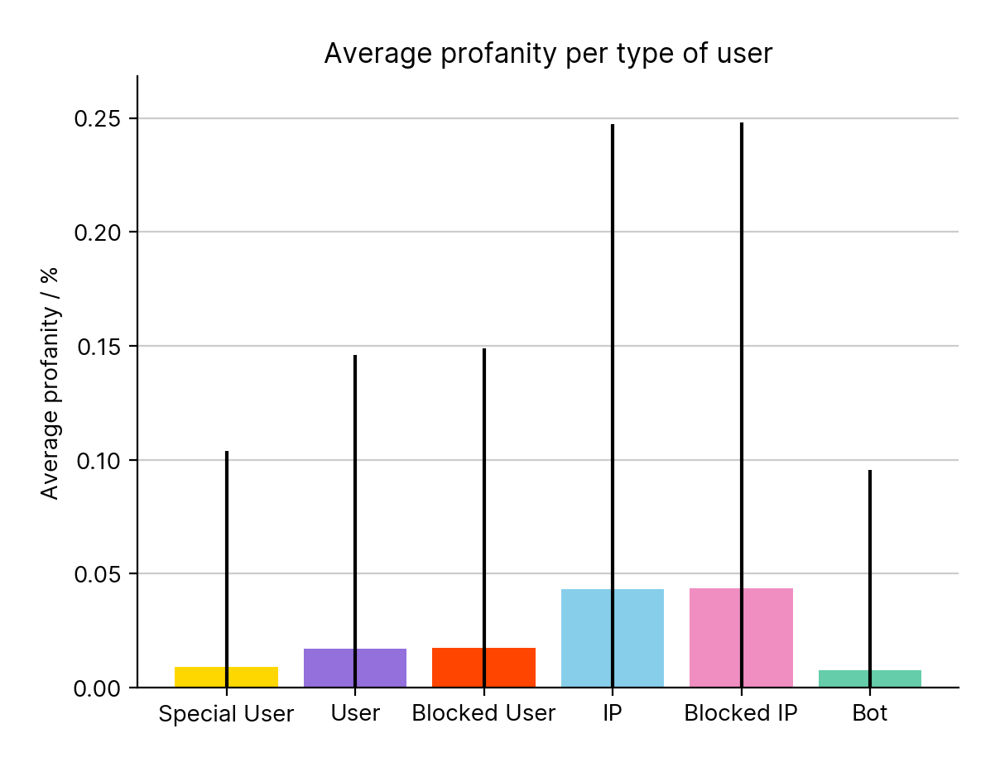
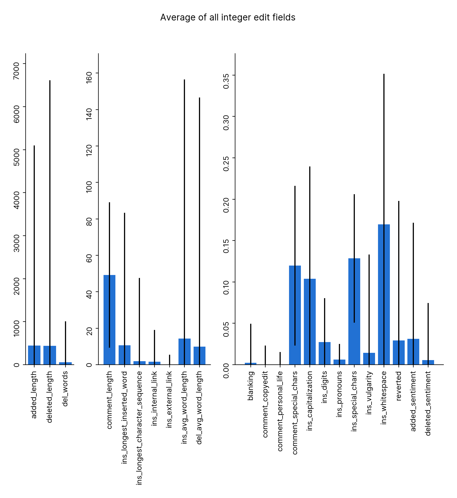
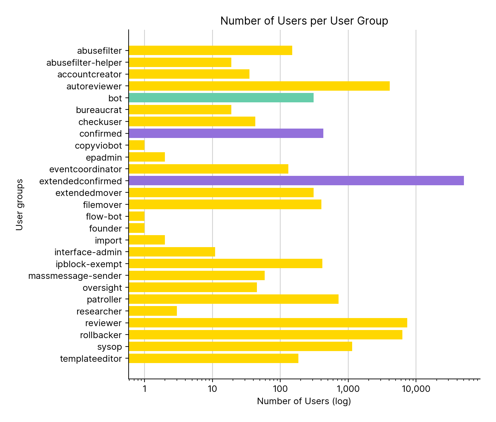
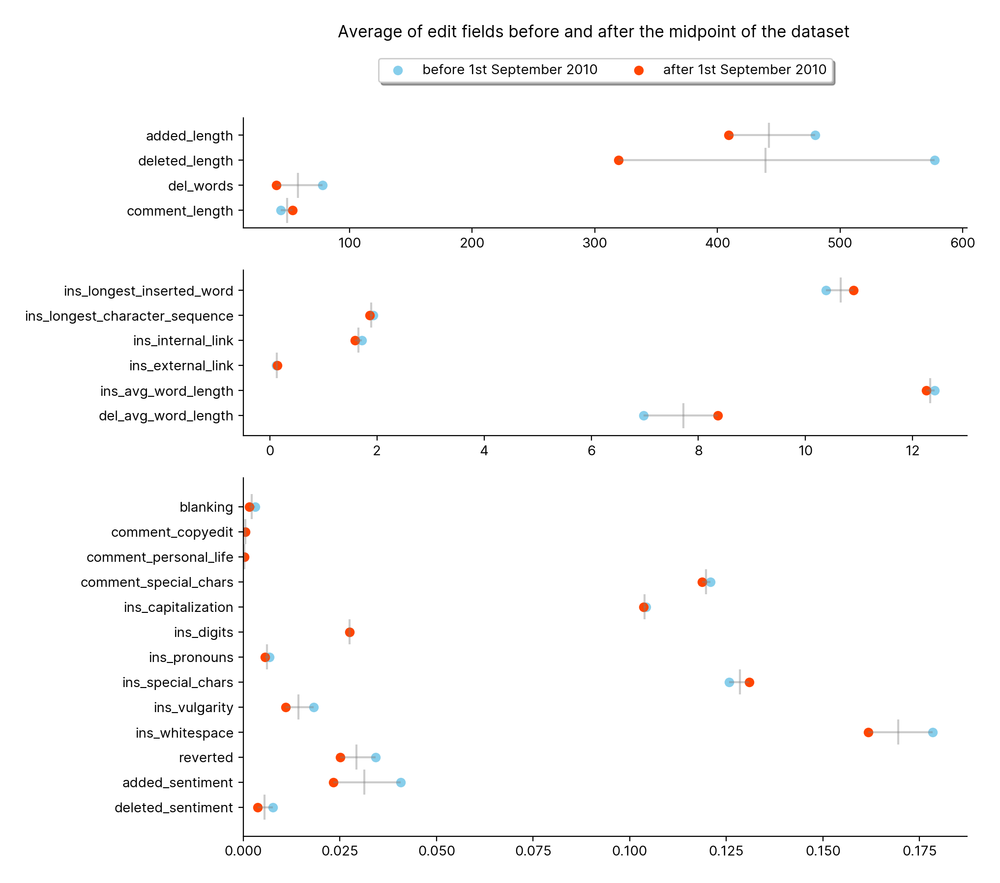

### 0 Partition Status

### 1 Distribution Of Main Edits

### 2 Distribution Of Talk Edits

### 3 Number Of Pages Per Namespace - linear

### 3 Number Of Pages Per Namespace - log

### 4 Edits Main Talk Neither

### 5 Num Main Talk Edits For Biggest Users

### 6 Num Main Talk Edits For Biggest Bots

### 7 Num Main Talk Edits For Biggest IPs

### 8 Distribution Of Main Edits User Bots

### 9 Edits Main Talk Neither User Bots

### 10 Edit Times User Bots

### 11 Distribution Of Edits Per Namespace

### 12 Sentiment User Bots Blocked IP

### 13 Sentiment Bots

### 14 Profanity All

### 15 Average All

### 16 Namespaces Edited By Top Five Hundred

### 17 Internal External Links

### 18 Special Users Plot - linear

### 18 Special Users Plot - log

### 19 Average All Special

### 20 Composition Of User IP

### 21 Composition Of User

### 22 Aggregations

### 23 Edit Booleans

### 24 User Booleans

### 25 Talkpage Edits Over Time

### 26 Average All Epoch

